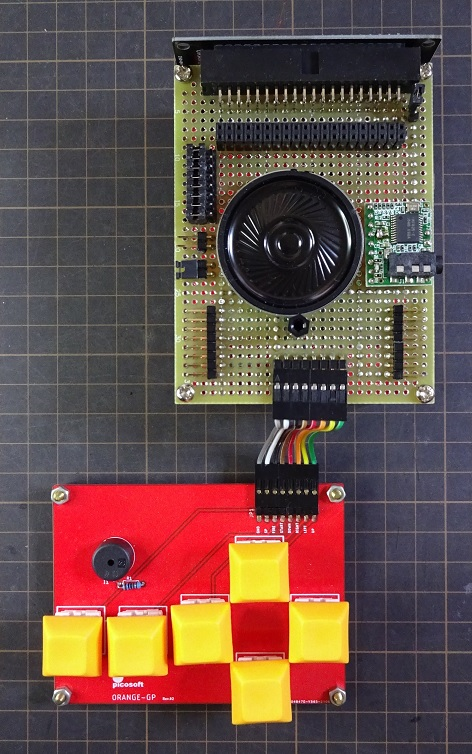
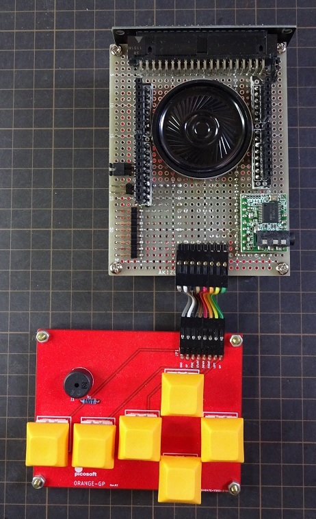
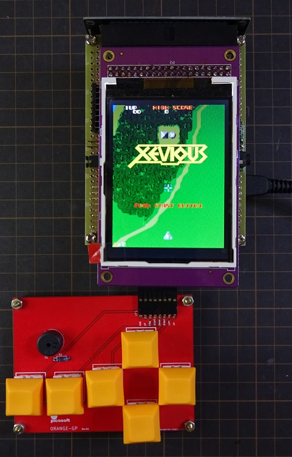
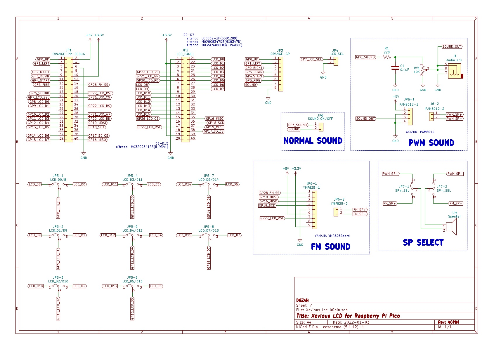
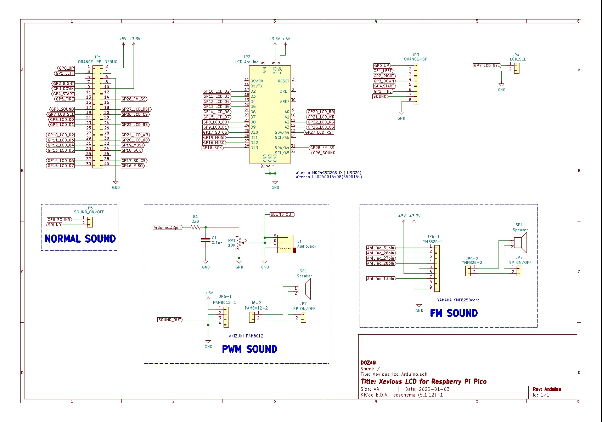
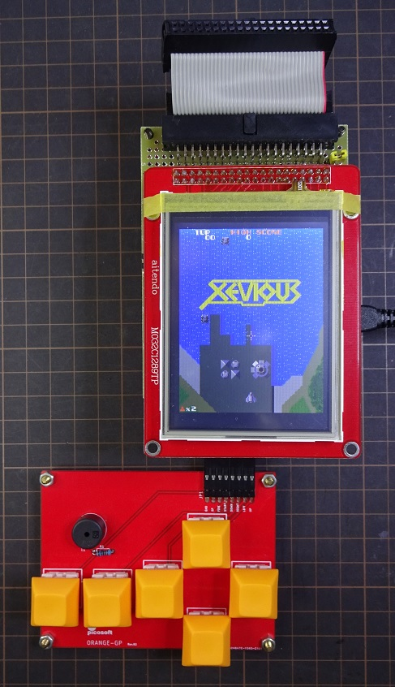
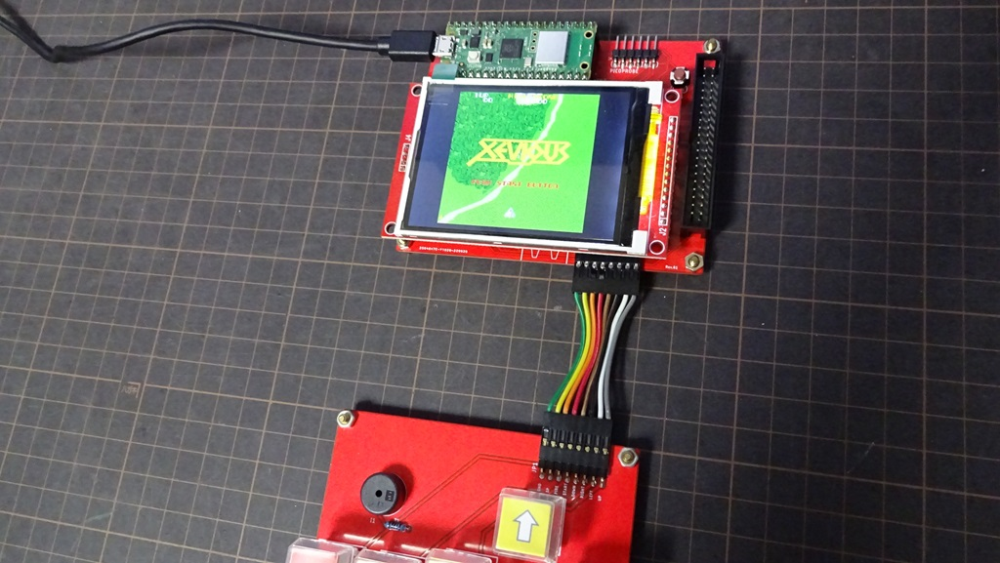

# Raspberry Pi Pico版 Xeviousもどき  
Katsumi様、KenKen様作成の[MachiKania type M](http://www.ze.em-net.ne.jp/~kenken/machikania/typem.html)用に作成した「Xeviousもどき」を  
Raspberry Pi Picoへ移植しました。  
音声は単音PWM、3和音PWM、YAMAHAのFM音源（[YMF825Board](http://uda.la/fm/)) (要3.3V改造)。  

LCDへの8bitデータの出力と書込み(WR)をpioで処理し自動化しました。  
又　メインの処理（core0）と音声の処理（core1)をマルチコア化しました。  

core0がメインの処理専用となりましたので　LCDへの全画面転送時間が  
約18.8msから約15.2msへ高速化(124%)する事が出来ました。  
但し　他の処理の関係でフレームレートはPIC版と同じく30fpsになります。  

<ケンケン様HP>http://www.ze.em-net.ne.jp/~kenken/index.html  

※3和音PWMは　boochowp様　[楽しくやろう。](https://blog.boochow.com/)内の  
　[Raspberry Pi Picoでピコピコサウンドを出してみる](https://blog.boochow.com/article/pico-pwm-sound.html)  
　を参考にさせて頂きました。  
　尚　3和音PWMは仕組み上　音量は小さい為アンプが必要です 。  
 
40PIN液晶用  
  

Arduinoシールド用、　3和音シールド、　FM音源シールド　　
  

動作写真  
  
動画は[こちら](https://youtu.be/qzr7wMj9juU)で公開しています。  

## 回路図  
40PIN液晶用
  
　　・JP1　picosoft製　Raspberry Pi Pico開発支援ボード  
　　・JP2　LCD032-2P/M032C9341B3等用  
　　・JP3　picosoft製　ゲームキーボード  
　　・JP4　ジャンパーピン　LCD_SEL　天地切替  
　　・JP5-0～JP5-7　ジャンパーピン　D0-D7/D8-D15　切替  
　　・JP6　ジャンパーピン　単音PWM SOUND ON/OFF  
　　・JP6-1,-2 (OPTOIN) 3和音PWM or FM音源  
　　・JP7-1,-2 (OPTION) スピーカー切替用  
    
Arduino液晶用,3和音用シールド,FM音源用シールド  
  
　　・JP1　picosoft製　Raspberry Pi Pico開発支援ボード  
　　・JP2　Arduino液晶用  
　　・JP3　picosoft製　ゲームキーボード  
　　・JP4　ジャンパーピン　LCD_SEL　天地切替  
　　・JP5　ジャンパーピン　単音PWM SOUND ON/OFF  
　　・JP6-1,-2 (OPTOIN) 3和音PWM or FM音源  
  
## 接続  
LCD 8Bitパラレル用の使用ポート  
　Pico　　　　LCD  
　GPI 8　　　D0 or D8  
　GPI 9　　　D1 or D9  
　GPI10　　　D2 or D10  
　GPI11　　　D3 or D11  
　GPI12　　　D4 or D12  
　GPI13　　　D5 or D13  
　GPI14　　　D6 or D14  
　GPI15　　　D7 or D15  
　GPIO20　　RD  
　GPIO21　　WR  
　GPIO22　　RS  
　GPIO26　　CS  
　GPIO27　　RST  

## 公開プログラム  
uf2フォルダー  
　Normalフォルダー　・・・　単音PWM  
　PWMフォルダー　 ・・・・　3和音PWM  
　FMフォルダー　・・・・・　FM音源  

Arduinoシールド用　　　　　確認済みLCD  
　Xevious_lcd_9325_XXX.uf2　aitendo [M024C9325SLD](https://www.aitendo.com/product/15381 )(ILI9325)  
　Xevious_lcd_0154_XXX.uf2　aitendo [UL024C0154D8](https://www.aitendo.com/product/16104)(S6D0154)    
　Xevious_lcd_8031_XXX.uf2　上記LCDで動作しない場合はお試しください。  
　Xevious_lcd_9486_pico_XXX.uf2　ORANGE pico社 [3.5インチTFT液晶(Arduinoシールド)](https://store.shopping.yahoo.co.jp/orangepicoshop/pico-m-045.html)(ILI9486)   
　　従来のILI9486版ではLCDパネルの仕様の違いで色の発色が異なる場合が有ります。  
　　その場合はこちらをご使用ください。  

 【追加】　※+5V接続要  
　Xevious_lcd_9341_XXX.uf2　ORANGE pico社 [2.4インチTFT液晶(Arduinoシールド)](https://store.shopping.yahoo.co.jp/orangepicoshop/pico-m-046.html)(ILI9341)  

8bit接続    
　D0-D7用　　　　　　　　　　　　　確認済みLCD  
　　Xevious_lcd_1289_XXX.uf2　aitendo [LCD032-2P](https://www.aitendo.com/product/13748)(SSD1289)  
　　Xevious_lcd_8347_XXX.uf2　aitendo [M028C8347D8](https://www.aitendo.com/product/10942)(HX8347-D)  
　　Xevious_lcd_9486_XXX.uf2　aitendo [M035C9486LB3](https://www.aitendo.com/product/11138)(ILI9486L)  
　　　※LCDの解像度320x480の為　縦横を1.3倍(320/240)に拡大しています。  
　D8-D15用  
　　Xevious_lcd_9341_XXX.uf2　aitendo [M032C9341B3](https://www.aitendo.com/product/11138)(ILI9341)  
　　Xevious_lcd_9320_XXX.uf2　aitendo M024C9320TP(ILI9320,R61505)  
　　　※工作魂様より提供頂きました。　有難うございました。 
## [MachiKania type P](http://www.ze.em-net.ne.jp/~kenken/machikania/typep.html) 対応  
　8bit接続版  
　Katsumi様、KenKen様作成のMachiKania type P用の試作基板を[工作魂様](https://github.com/kosaku-damashii/MachiKania-MachiKaniaPhyllosomaBB)が  
　作成されました。  
　工作魂様　試作基板（Ver.1.0）    
  

　使用ポート  
　　Pico　　　LCD  
　　GPI 0　　D0 or D8  
　　GPI 1　　D1 or D9   
　　GPI 2　　D2 or D10  
　　GPI 3　　D3 or D11  
　　GPI 4　　D4 or D12  
　　GPI 5　　D5 or D13  
　　GPI 6　　D6 or D14  
　　GPI 7　　D7 or D15  
　　GPI10　　RD  
　　GPI11　　WR  
　　GPI12　　RS  
　　GPI13　　CS  
　　GPI14　　RST  
　　GPI15　　LCD_SEL  

　　GPI27　　FM_SS(FM接続用SPI）  

　　PWM_SOUNDとGameコントローラーはMachiKania type Pと  
　　同じポートを使用。  

　SPI接続版(VERTICALバージョン）  
  
　SPI接続版(HORIZONTALバージョン）  
  

　液晶接続など使用ポートはMachiKania type Pと同様です。  
　「MACHIKAP.INI」に「LCD180TURN」と記載すると表示を180度反転します。  
　　又「ROTATEBUTTONS」を記載すると上下左右ボタンを入れ替ます。  
　
　※SPIクロックはオーバークロック（62.5MHz）しています。  

MachiKania type Pフォルダー内のファイルを参照ください。  
