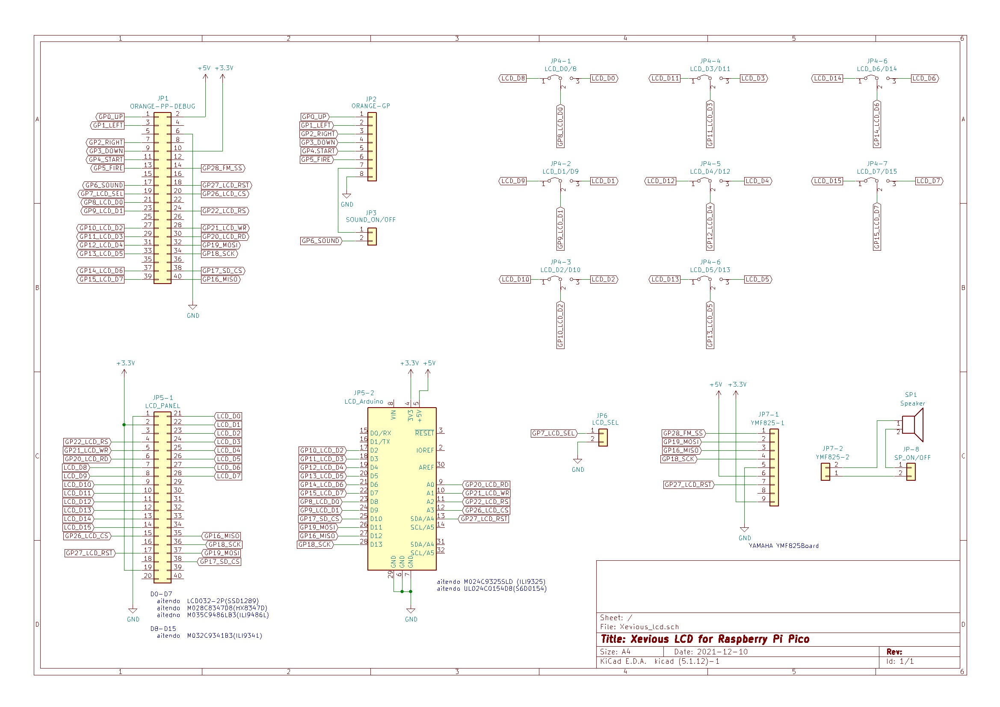

# Raspberry Pi Pico版 Xeviousもどき  
ケンケン様作成の[MachiKania type M](http://www.ze.em-net.ne.jp/~kenken/machikania/typem.html)用に作成した「Xeviousもどき」を  
Raspberry Pi Picoへ移植しました。  
音声はPWMとYAMAHAのFM音源（[YMF825Board](http://uda.la/fm/)) を追加(要3.3V改造)。  
フレームレートはPIC版と同じく30fpsを達成。  
<ケンケン様HP>http://www.ze.em-net.ne.jp/~kenken/index.html  

8Bit接続用  
  

Arduinoシールド用  
  

動作写真  
  
動画は[こちら](https://youtu.be/OOlS4jG3gyY)で公開しています。  

## 回路図  
  
　一応SDカードの配線も実施。  
　その関係で空きポートが無くなりました。  
　　・JP1　picosoft製　Raspberry Pi Pico開発支援ボード  
　　・JP2　picosoft製　ゲームキーボード  
　　・JP3　ジャンパーピン　PWM SOUND ON/OFF  
　　・JP4-0～JP4-7　ジャンパーピン　D0-D7/D8-D15　切替  
　　・JP5-1　LCD032-2P/M032C9341B3等用  
　　・JP5-2　Arduinoシールド用  
　　・JP6　ジャンパーピン　LCD_SEL　天地切替  
　　・JP7-1，-2　YMF825Board（要3.3V改造）  
　　・JP8　ジャンパーピン　FM音源 ON/OFF  8Bit

## 接続  
LCD 8Bitパラレル用の使用ポート  
　Pico　　　LCD  
　GPI 8　　　D0 or D8  
　GPI 9　　　D1 or D9  
　GPI10　　　D2 or D10  
　GPI11　　　D3 or D11  
　GPI12　　　D4 or D12  
　GPI13　　　D5 or D13  
　GPI14　　　D6 or D14  
　GPI15　　　D7 or D15  
　GPIO20　　RD  
　GPIO21　　WR  
　GPIO22　　RS  
　GPIO26　　CS  
　GPIO27　　RST  

## 公開プログラム  
Arduinoシールド用　　　　　確認済みLCD  
　Xevious_lcd_9325.uf2　aitendo　M024C9325SLD (ILI9325)  
　Xevious_lcd_0154.uf2　aitendo　UL024C0154D8(S6D0154)  
　Xevious_lcd_8031.uf2　上記LCDで動作しない場合はお試しください。  

8Bit接続用　　　　　　　　確認済みLCD  
　Xevious_lcd_9341.uf2　aitendo　M032C9341B3(ILI9341)    
　Xevious_lcd_1289.uf2　aitendo　LCD032-2P(SSD1289)  
　Xevious_lcd_8347.uf2　aitendo　M028C8347D8(HX8347D)  
　Xevious_lcd_9486.uf2　aitedno　M035C9486LB3(ILI9486L)  
　※LCDの解像度320x480の為　縦横を1.5倍に拡大しています。  
 
